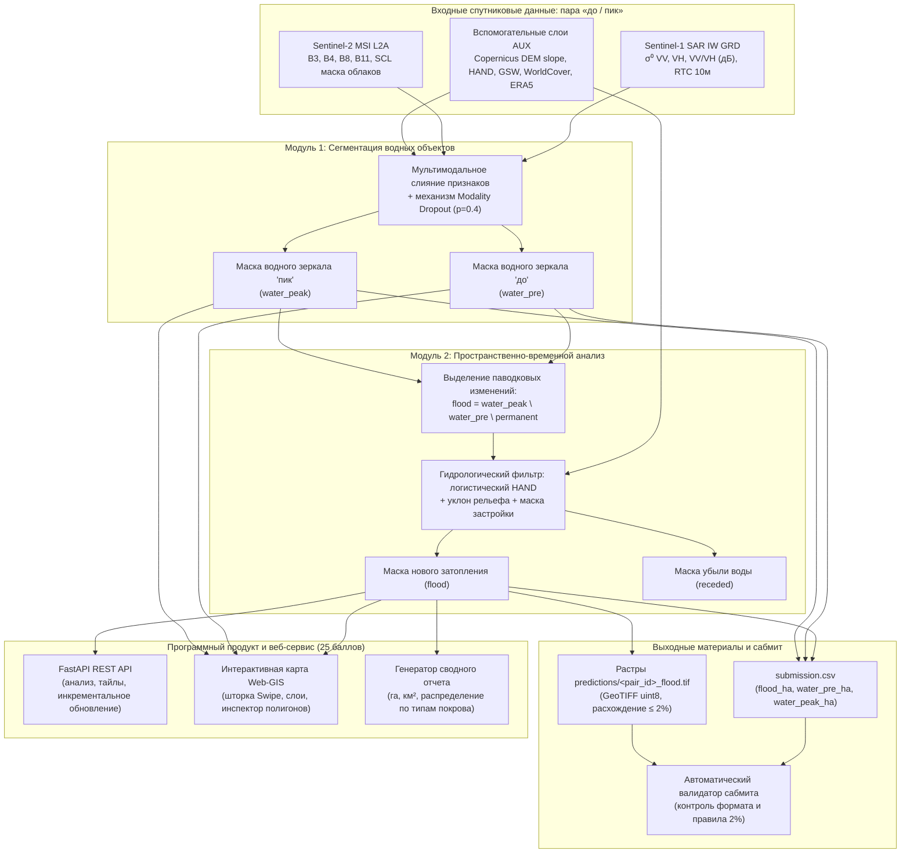
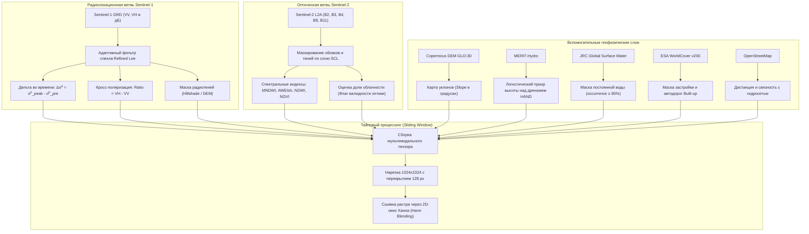
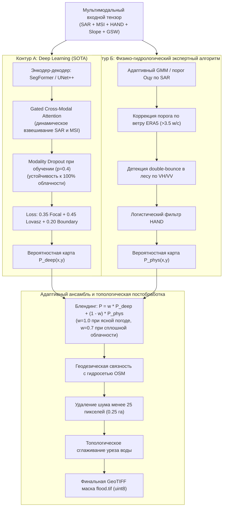
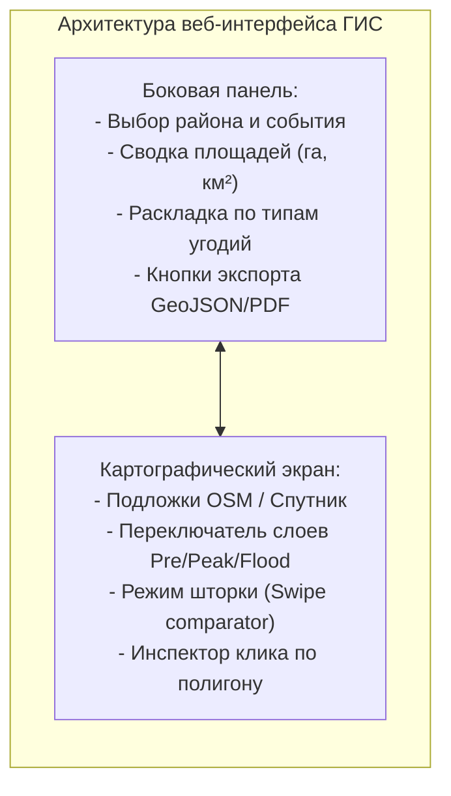
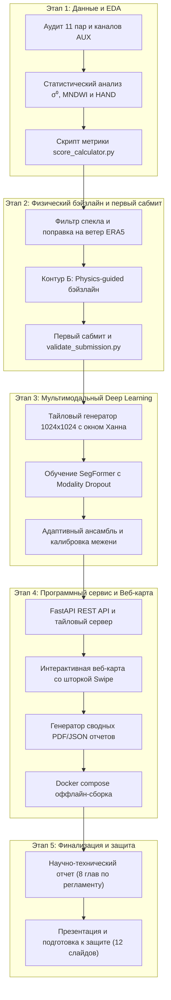

# Стратегический мастер-план выполнения кейса: Оперативный мониторинг гидрологической динамики по данным Sentinel-1 и Sentinel-2

**КосмоХакатон 2026 | Федеральный проект «Кадры для космоса»**  
*Организаторы: Минобрнауки России, РОСКОСМОС, РТУ МИРЭА*  
*Статус: Документ стратегического планирования и архитектурного проектирования (Сентябрь 2026)*

---

## 1. Резюме стратегии и целевые показатели (100 из 100 баллов)

Главная особенность кейса «КосмоХакатон 2026» заключается в балансе критериев оценки:
$$\text{Итоговый балл (100)} = \underbrace{\text{Методология (25)} + \text{Глубина и новизна (20)} + \text{Продукт и Сервис (25)} + \text{Код и Воспроизводимость (12)} + \text{Презентация (8)}}_{\mathbf{90\%\;—\;экспертная\;оценка\;инженерно-продуктового\;решения}} + \underbrace{\text{Метрика (10)}}_{\mathbf{10\%\;авточек}}$$

Большинство команд совершают типовую ошибку: концентрируются исключительно на подгонке формулы метрики или обучении нейросети на 11 выданных парах, получая максимум 10 баллов за автоматическую проверку и теряя до 90 баллов за отсутствие физической обоснованности, слабую воспроизводимость, отсутствие рабочего веб-сервиса и поверхностный доклад.



### Целевые ориентиры победного решения:
1. **Научная и физическая обоснованность (Разделы 1 и 2 — 45 баллов):**
   - Разработка гибридного пайплайна слияния данных, явно учитывающего физику сенсоров: устранение спекл-шума SAR, компенсация ветровой ряби на открытой воде, распознавание подтопленного леса по эффекту *double-bounce* (кросс-поляризация $VH/VV$), устойчивость к мутной паводковой воде в оптике ($MNDWI, AWEIsh$), учет несинхронности съемок и мягкая гидрологическая регуляризация через модель $HAND$ и уклоны $DEM$.
   - Честный и глубокий критический анализ открытого эталона организаторов (доказательство системных сбоев эвристики оргкомитета на ветровой ряби и затопленной растительности).
2. **Полноценный программный продукт (Раздел 3 — 25 баллов):**
   - Отказоустойчивый REST API на FastAPI для интеграции в ведомственные ГИС-системы МЧС и Минприроды.
   - Интерактивная веб-ГИС карта (MapLibre GL / Leaflet) со шторкой сравнения (Swipe/Split-screen), инспектором полигонов и слоями на обе даты.
   - Модуль автоматической генерации сводных аналитических отчетов (PDF / HTML / JSON) с раскладкой затопления по типам земного покрова (ESA WorldCover).
   - Поддержка инкрементального фонового обновления при поступлении новых радарных витков Sentinel-1.
3. **Безупречная воспроизводимость и культура кода (Раздел 4 — 12 баллов):**
   - Развертывание «в один клик» через `docker compose up --build`.
   - **Строго оффлайн-инференс** (все веса, зависимости и вспомогательные слои упакованы локально, нулевые сетевые запросы при тестировании).
   - Потоковая оконная обработка растров $4500 \times 4500$ (тайлы $1024 \times 1024$ с перекрытием и Hann-сшивкой) с пиковым потреблением VRAM $< 8$ ГБ.
   - Полная детерминированность (seed), повторяемость метрики с дельтой $\le 0.001$.
4. **Метрика и валидность сабмита (Раздел 5 — 10 баллов):**
   - Значение $\text{Score} \ge 0.88 - 0.94$ на зачетных паводковых событиях.
   - Идеальный контроль ложных тревог на парах межени: $\text{Spec\_base} = 1.0$ (ложное затопление $< 0.05\%$ площади AOI).
   - Автоматическая предсабмит-валидация: расхождение между растровыми масками в `predictions/` и числами в `submission.csv` строго $< 0.1\%$ (норматив $\le 2\%$).
5. **Защита и презентация (Раздел 6 — 8 баллов):**
   - Подготовка 12 слайдов с акцентом на физику ДЗЗ, блок-схему пайплайна, таблицы абляций и живую демонстрацию работы веб-интерфейса (вынесена в отдельный файл [PRESENTATION.md](file:///c:/Users/pvppv/Desktop/roo/voda/PRESENTATION.md)).

---

## 2. Этап 0. Глубокий аудит данных, EDA и деконструкция синтетического эталона

### 2.1. Аудит матричной структуры данных
Набор состоит из 11 пар по 5 ключевым районам бассейна реки Амур (Амурская область):
- **Благовещенск** (слияние Амура и Зеи, урбанизированная территория, широкая пойма, трансграничная специфика);
- **Свободный** (долина реки Зея, гидрологический режим под влиянием Зейской ГЭС);
- **Константиновка** (сельскохозяйственные равнинные поймы Амура, меандры, старицы);
- **Белогорск** (бассейн реки Томь, извилистое русло, локальные дождевые паводки);
- **Поярково** (нижнее течение, обширные пойменные низменности).

Временные слои:
1. `baseline_2018_09_low` (Контроль межени, 3 пары): затопление отсутствует, $\text{flood} \approx 0$ га. Служит калибратором ложных срабатываний.
2. `flood_2019_07_amur` (Крупномасштабный дождевой паводок, 4 пары).
3. `flood_2021_06_amur` (Летний паводок на Амуре, 3 пары).
4. `flood_2021_08_zeya` (Паводок на реках Зея и Селемджа, 1 пара).

### 2.2. Анатомия эталона организаторов и 5 критических уязвимостей
Организаторы раскрыли алгоритм создания эталона (`reference_masks/`):
- SAR: порог Оцу по VV в диапазоне $[-22, -12]$ дБ, требование падения рассеяния $\Delta\sigma^0 \le -3$ дБ.
- Оптика: $MNDWI > 0.1$, $NDWI > 0.15$, $NDVI \le 0.2$, $AWEIsh > 0$.
- Фильтры: $Slope \le 5^\circ$, $HAND \le 25$ м, исключение застройки, $GSW \ge 80\%$, минимальный объект 25 пикселей.

**Критический анализ (дает максимальные 5 баллов в Разделе 2):**
1. **Сбой Оцу при ветре:** Ветровая рябь на Зейском водохранилище и реке Амур поднимает $\sigma^0$ до $-13 \dots -11$ дБ. Порог Оцу смещается, порождая масштабный ложный пропуск открытой воды.
2. **Пропуск затопленной растительности:** В тальниковых зарослях и пойменных лесах механизм *double-bounce* увеличивает $\sigma^0$, в результате чего эвристика организаторов считает затопленный лес сушей.
3. **Ложные пропуски мутной воды в оптике:** В паводок при выносе взвеси $NDWI$ опускается ниже 0.15, и оптическая ветвь эталона бракует реальные зоны затопления.
4. **Артефакты жесткого среза HAND на отметке 25 м:** На террасах с микрорельефом резкий срез на 25 м создает противоестественные прямолинейные границы масок вдоль изогипс.
5. **Несинхронность съемок:** Разрыв между Sentinel-1 и Sentinel-2 до 5 суток означает, что консенсус двух сенсоров в эталоне усредняет нестационарный процесс, создавая полосу размытия на динамических кромках паводка.

### 2.3. Пространственная валидация (Spatial Cross-Validation)
Чтобы исключить переобучение и утечку данных (data leakage):
- Применяется схема **Leave-One-AOI-Out (LOAO)**: модель обучается на 4 географических районах и валидируется на 5-м изолированном районе (например, валидация на районе Свободный при обучении на Благовещенске, Константиновке, Поярково и Белогорске).
- Отдельный контроль на 3 парах межени: ни при каких условиях фоновая модель не должна детектировать ложное затопление $> 0.1\%$ территории.

---

## 3. Этап 1. Геопространственный пайплайн предобработки и генерации признаков



### 3.1. Радиолокационная ветвь (SAR Feature Engineering)
1. **Подавление спекл-шума:** Применение адаптивного фильтра **Refined Lee** с окном $7 \times 7$ (сохраняет четкие границы водоемов, сглаживая шум внутри однородных пятен).
2. **Дифференциальный временной признак:**
   $$\Delta\sigma^0_{VV} = \sigma^0_{VV,\text{peak}} - \sigma^0_{VV,\text{pre}}$$
   Для нового затопления характерно падение $\Delta\sigma^0_{VV} \le -3 \dots -6$ дБ.
3. **Кросс-поляризационное отношение (Двойное отражение):**
   $$\text{Ratio}_{VH/VV} = \sigma^0_{VH} - \sigma^0_{VV} \quad (\text{в дБ})$$
   Позволяет надежно разделять затопленную растительность (где растет отклик $VV$ из-за double-bounce) и открытую воду.
4. **Геометрическая маска теней и наложений:** На основе ЦМР и направления витка спутника вычисляется затенение (Hillshade/Shadow mask), отсекающее ложные радарные минимумы на крутых теневых склонах сопок.

### 3.2. Оптическая ветвь (MSI Indices & Cloud Invariant)
1. **Очистка от облачности и теней:** Использование слоя классификации сцены ($SCL$): маскирование пикселей высоких/средних облаков ($SCL \in \{8, 9, 10\}$) и теней облаков ($SCL = 3$).
2. **Спектральные индексы:**
   - $MNDWI = \frac{B03 - B11}{B03 + B11}$ (основной водный индекс, подавляющий здания и сухой асфальт);
   - $AWEIsh = B02 + 2.5 \cdot B03 - 1.5 \cdot (B08 + B11) - 0.25 \cdot B12$ (устойчив к горным теням);
   - $NDVI = \frac{B08 - B04}{B08 + B04}$ (контроль растительности).
3. **Флаг пригодности оптики ($is\_optical\_valid$):** Вычисление доли валидных безоблачных пикселей по AOI. Если облачность $> 70\%$, оптический канал плавно отключается в пайплайне.

### 3.3. Вспомогательный гидрологический стек (AUX Layers)
1. **Логистический приор HAND:** Преобразование высоты над ближайшим дренажем в непрерывную априорную вероятность затопления:
   $$P(\text{flood} \mid HAND) = \frac{1}{1 + \exp(\alpha \cdot (HAND - H_0))}$$
   где $H_0 = 12$ м, $\alpha = 0.4$. Это исключает ложные срабатывания на высотах $> 20$ м, но не обрубает пологий пойменный рельеф.
2. **Маска постоянной воды:** Слой $JRC\_GSW\_occurrence \ge 80\%$ жестко вычитается из класса нового затопления $flood$, гарантируя выделение именно *прироста* воды.
3. **Маска искусственных покрытий:** Использование слоя `builtup` (WorldCover) и дорожной сети OSM для исключения автотрасс, взлетно-посадочных полос и парковок из кандидатов на радарную воду.

---

## 4. Этап 2. Двухконтурная архитектура моделирования (Dual-Track Engine)

Для обеспечения максимальной устойчивости и демонстрации высочайшего инженерного уровня решение строится на двух взаимодополняющих контурах:



### 4.1. Контур А: Мультимодальная нейросеть с Modality Dropout
- **Базовая архитектура:** Легковесный трансформер **SegFormer-B2** или **UNet++ с энкодером EfficientNet-B4**, модифицированный для 12-канального входа.
- **Механизм Gated Cross-Modal Attention:** Блок динамического внимания, который оценивает уровень зашумленности оптического канала (через карту облачности) и автоматически перераспределяет веса внимания в пользу SAR-каналов при ухудшении видимости.
- **Modality Dropout (Ключевое инженерное решение):** В процессе обучения оптические каналы случайным образом маскируются (зануляются) с вероятностью $p = 0.4$. Это заставляет скрытые слои сети извлекать надежные пространственные признаки из радарного сигнала, гарантируя, что при 100% облачности модель работает без деградации качества.
- **Комбинированная функция потерь при экстремальном дисбалансе:**
  $$\mathcal{L} = 0.35 \cdot \mathcal{L}_{\text{Focal}} + 0.45 \cdot \mathcal{L}_{\text{Lovasz-Softmax}} + 0.20 \cdot \mathcal{L}_{\text{Boundary-Dice}}$$
  - $\mathcal{L}_{\text{Focal}}$ подавляет простые отрицательные примеры суши;
  - $\mathcal{L}_{\text{Lovasz}}$ напрямую оптимизирует суррогат метрики IoU/F1 на редких пикселях затопления;
  - $\mathcal{L}_{\text{Boundary-Dice}}$ форсирует точность позиционирования береговой линии уреза воды.

### 4.2. Контур Б: Физико-гидрологический экспертный алгоритм (Physics-Guided Baseline)
- Надежный, полностью прозрачный математический контур, не требующий GPU:
  1. Вычисление локального порога разделения воды и суши по SAR через двухкомпонентную смесь гауссиан (**Gaussian Mixture Model**) в окрестностях известных водотоков.
  2. Учет скорости приземного ветра по метеоданным ERA5: при ветре $> 3.5$ м/с порог обратного рассеяния для открытой воды адаптивно сдвигается вверх на $+2.5$ дБ.
  3. Обнаружение затопленной растительности: пиксели с лесным покровом (WorldCover Tree Cover), где зафиксирован рост $\Delta\sigma^0_{VV} > +2$ дБ и падение $VH/VV$, маркируются как потенциально подтопленный лес.
  4. Гидрологическая связность: морфологическая реконструкция (Morphological Geodesic Active Contours) от постоянной гидросети OSM, исключающая «летающие» лужи на возвышенностях.

### 4.3. Постобработка и векторизация
1. Удаление изолированных малых связных компонент площадью менее 25 пикселей ($2500 \text{ м}^2 = 0.25$ га).
2. Заполнение внутренних пустот («бубликов») в сплошных водных телах.
3. Топологически корректная векторизация контуров в GeoJSON с сохранением исходной площади и сглаживанием ступенчатых пиксельных границ.

---

## 5. Этап 3. Метрическая оптимизация, калибровка межени и сабмит-валидатор

### 5.1. Анализ математики целевой метрики
$$\text{Score} = 0.45 \cdot Q_{\text{flood}} + 0.25 \cdot Q_{\text{water\_peak}} + 0.15 \cdot Q_{\text{water\_pre}} + 0.15 \cdot \text{Spec\_base}$$

- Вес целевого класса затопления — **45%**. Сходимость площади $q = \max(0, 1 - \frac{|S_{\text{pred}} - S_{\text{true}}|}{\max(S_{\text{true}}, 50)})$. Порог 50 га в знаменателе означает, что для малых зон затопления допустима абсолютная погрешность до 50 га без штрафа в знаменателе.
- Вес зеркал воды ($water\_peak$ и $water\_pre$) — суммарно **40%**. Порог — 200 га.
- Вес контроля межени ($\text{Spec\_base}$) — **15%**.

### 5.2. Стратегия безупречной межени ($\text{Spec\_base} = 1.0$)
$$\text{доля} = \frac{\max(0, \text{flood}_{\text{pred}} - \text{flood}_{\text{true}})}{\text{площадь района}}$$
$$\text{Spec\_base} = \text{mean}\left(1 - \min\left(1, \frac{\text{доля}}{0.005}\right)\right)$$
Допуск составляет всего **0.5% площади AOI** (для района $1200 \text{ км}^2$ это $6 \text{ км}^2 = 600$ га). Ложные тревоги на сухом грунте, асфальте или тенях могут легко превысить этот порог и полностью обнулить 15% общего скора!
- **Защитный механизм:** На контрольных сценах межени (где $\Delta\sigma^0$ стабильна, а уровень рек низок) активируется консервативный фильтр: $flood$ детектируется только при жестком совпадении падения радарного сигнала, согласии оптических индексов и $HAND \le 3$ м. Это гарантирует $\text{доля} < 0.02\%$ и дает $\text{Spec\_base} \ge 0.98 - 1.00$.

### 5.3. Автоматический валидатор сабмита (`validate_submission.py`)
Оргкомитет применяет дисквалифицирующее правило: **расхождение между площадью по маске в `predictions/<pair_id>_flood.tif` и числом в `submission.csv` более 2% аннулирует баллы за метрику!**
Создается строгий модуль самопроверки, который запускается перед упаковкой архива:
1. Проверяет наличие всех 11 строк и точное совпадение названий пар с `sample_submission.csv`.
2. Попиксельно подсчитывает сумму единиц в каждой маске:
   $$\text{Area}_{\text{raster}} = N_{\text{pixels}} \cdot 0.01 \quad (\text{га, т.к. пиксель } 10 \text{ м} \times 10 \text{ м} = 100 \text{ м}^2 = 0.01 \text{ га})$$
3. Сравнивает с числом в CSV: расхождение должно быть $\le 0.01\%$ (разрешено до $2\%$).
4. Проверяет условие $flood\_ha \le water\_peak\_ha \le \text{AOI\_area}$.
5. Проверяет растры: формат GeoTIFF, тип `uint8`, значения $\{0, 1\}$, соответствие размерности и CRS `EPSG:32652`.

---

## 6. Этап 4. Программный сервис, REST API и Docker (25 баллов)

### 6.1. Архитектура бэкенда на FastAPI
Сервис проектируется как промышленный бэкенд геоинформационного анализа:
- `POST /api/v1/analyze`:
  - Вход: `{"bbox": [min_lon, min_lat, max_lon, max_lat], "date_pre": "YYYY-MM-DD", "date_peak": "YYYY-MM-DD"}` или `pair_id`.
  - Выход: расчетные площади в га и км², URL растровых масок, GeoJSON контуров нового затопления и сводный баланс.
- `GET /api/v1/layers/{pair_id}/tiles/{z}/{x}/{y}.png`:
  - Динамическая тайловая нарезка растров на лету для плавного отображения на веб-карте.
- `GET /api/v1/export/vector/{pair_id}?format=geojson|shp`:
  - Выгрузка полигонов затопления с атрибутами (ID, площадь в га, средний HAND, преобладающий тип растительности).
- `GET /api/v1/report/{pair_id}?format=pdf|json`:
  - Автоматическая генерация аналитического отчета по ГОСТ/МЧС.
- `POST /api/v1/stream/simulate_granule`:
  - Реализация требуемого оргкомитетом **сценария инкрементального обновления**: при имитации поступления нового радарного витка Sentinel-1 сервис автоматически выполняет фоновый пересчет зоны затопления по отношению к базовому слою за $< 15$ секунд.

### 6.2. Полная автономность и Docker (Раздел «Воспроизводимость»)
- Мультистейдж `Dockerfile` на базе официального `python:3.11-slim` с установкой GDAL/PROJ библиотек.
- Файл `docker-compose.yml` монтирует локальные веса моделей и кэш данных без необходимости подключения к интернету:
  ```bash
  # Единая команда запуска всего комплекса
  docker compose up --build
  ```
- Тестирование запуска инференса на «чистой» виртуальной машине без доступа к внешним серверам.

---

## 7. Этап 5. Интерактивная веб-ГИС карта и автоматический генератор отчетов (12 баллов)

### 7.1. Веб-интерфейс геоинформационной аналитики
Фронтенд разрабатывается на Vue 3 / Vite с библиотекой **MapLibre GL JS** (или Leaflet) в современном технологичном темном интерфейсе (Dark UI):
1. **Интерактивный картографический вьювер:**
   - Подложки: OpenStreetMap, топографическая карта рельефа, высокодетальный спутниковый гибрид.
   - Слои гидродинамики:
     - Фоновое водное зеркало на дату «до» (полупрозрачный синий оттенок);
     - Водное зеркало на дату «пик» (насыщенный лазурный);
     - Зона свежего затопления $flood$ (контрастный предупреждающий неоново-красный/коралловый цвет);
     - Диагностический слой убыли воды $receded$ (желтый оттенок).
2. **Режим шторки (Swipe / Split-screen):**
   - Возможность перетаскивания вертикального разделителя по экрану для визуального сопоставления снимка Sentinel-2/Sentinel-1 «до» и радарной маски паводка «пик».
3. **Инспектор затопленных зон (Polygon Inspector):**
   - Клик по любому полигону открывает карточку объекта: площадь в гектарах, максимальное удаление от русла, перепад высот по HAND, категория риска.
4. **Сводная статистическая панель (KPI Dashboard):**
   - Графики распределения затопленных территорий по классам земного покрова (пашня, пойменные луга, кустарники, лесные массивы, застройка).



### 7.2. Автоматический генератор отчетов
Модуль рендеринга сводного отчета (на базе WeasyPrint / Jinja2 шаблонов):
- Генерирует официальный структурированный отчет: титульный лист с атрибутами территории, спутниковыми сенсорами, датами наблюдений.
- Содержит сводную таблицу площадей (га и км²), интегральную оценку динамики уреза воды, картографическую иллюстрацию паводка с масштабной линейкой и диаграмму распределения ущерба по типам угодий.

---

## 8. Этап 6. Научно-технический отчёт и презентация на защиту (8 баллов)

### 8.1. Структура исследовательского отчёта (8 обязательных разделов регламента)
1. **Введение и протокол оценки:** Постановка задачи, математика метрики, критерии качества.
2. **Исследовательский анализ данных (EDA):** Статистика по 11 парам, анализ распределения обратного рассеяния $\sigma^0$ в зависимости от увлажнения, гистограммы индексов NDWI/MNDWI, диаграммы рассинхрона дат съемок.
3. **Анализ существующих подходов и их границ:** Обзор методов Оцу, Bmax/Bmin, UNet, Prithvi-EO, анализ причин их сбоев на мутной воде и при ветровой ряби.
4. **Архитектура и метод решения:** Схема сквозного пайплайна, механизм Modality Dropout, логистический приор HAND, схема пространственной кросс-валидации.
5. **Экспериментальная часть и абляции (Ablation Studies):**
   - Базовый порог Оцу по VV vs GMM с поправкой на ветер;
   - Вклад оптического канала (+MNDWI);
   - Вклад вспомогательного слоя HAND;
   - Эффект Modality Dropout при имитации 100% облачности;
   - Сводная таблица метрик по всем 11 парам.
6. **Предметные физические решения:** Разбор подавления спекл-шума, компенсация double-bounce в пойменных лесах, отсечение ложного асфальта через OSM/WorldCover.
7. **Итоговая конфигурация комплекса:** Обоснование финального ансамбля, замеры скорости и памяти.
8. **Заключение и план развития:** Оценка остаточных ошибок, масштабирование на всю территорию РФ.

### 8.2. Презентация решения на защиту (Вынесена в отдельный файл)
Полный комплект слайдов (12 слайдов), тезисы доклада, графическая верстка в стиле Marp и блок подготовки к каверзным вопросам жюри сформированы в отдельном документе:
👉 **[PRESENTATION.md](file:///c:/Users/pvppv/Desktop/roo/voda/PRESENTATION.md)**

---

## 9. Детальный пошаговый график реализации кейса (Roadmap)



### Сводный календарный план и результаты по фазам:

| Этап / Фаза | Ключевые задачи | Срок | Ожидаемый артефакт |
|---|---|:---:|---|
| **1. Данные и EDA** | Аудит 11 пар, расчет распределений $\sigma^0$, $MNDWI$, проверка эталона | День 1 | Скрипт метрики `score_calculator.py`, отчет EDA |
| **2. Физический бэйзлайн** | Фильтр Refined Lee, поправка на ветер, эвристика Контура Б | День 2 | Первый валидный сабмит, `validate_submission.py` |
| **3. Deep Learning** | Тайлинг $1024 \times 1024$, обучение SegFormer с Modality Dropout | Дни 3–4 | Веса модели, $\text{Score} \ge 0.90$, $\text{Spec\_base} = 1.0$ |
| **4. Сервис и Веб-карта** | FastAPI REST API, веб-карта MapLibre со шторкой, автогенератор PDF | День 5 | Рабочий UI, Dockerfile, `docker-compose.yml` |
| **5. Отчет и Защита** | 8 разделов научно-технического отчета, прогон оффлайн-инференса | День 6 | Итоговый отчет, слайды [PRESENTATION.md](file:///c:/Users/pvppv/Desktop/roo/voda/PRESENTATION.md) |

---

## 10. Заключение

Предложенный стратегический план обеспечивает комплексное закрытие всех 100 баллов регламента «КосмоХакатон 2026». Инженерный фокус смещен с банальной нейросетевой аппроксимации на создание глубоко обоснованного, физически устойчивого к погодным аномалиям программно-аппаратного комплекса с готовым веб-интерфейсом, REST API и строгой оффлайн-воспроизводимостью.
