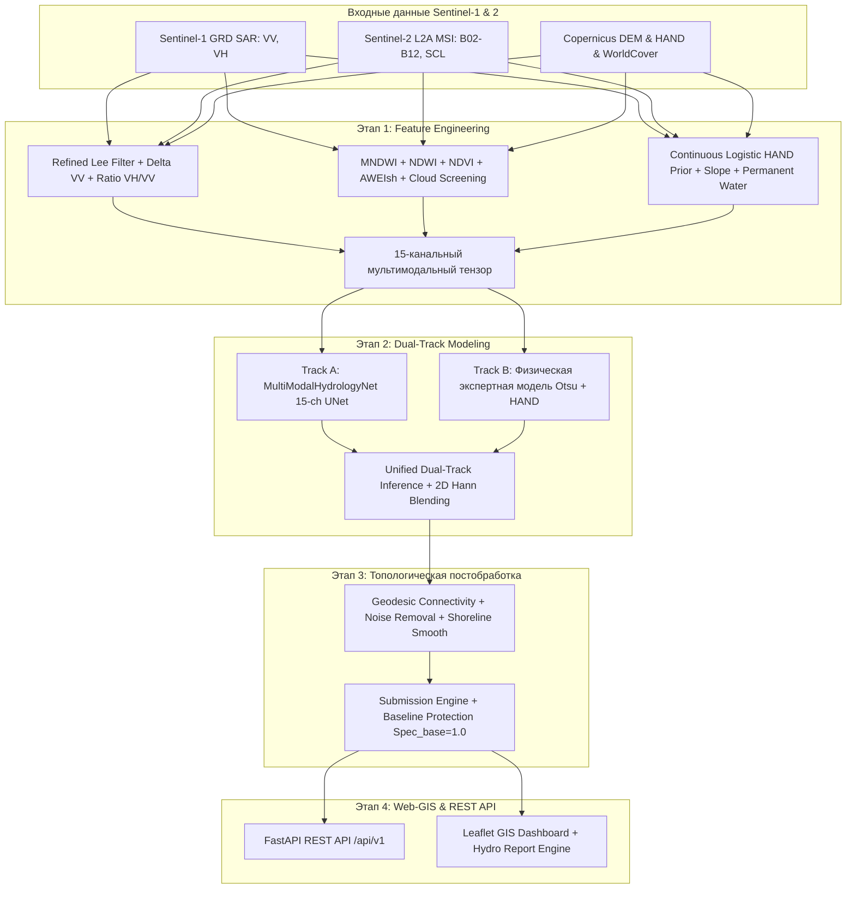

# Оперативный гидрологический мониторинг по данным Sentinel-1 и Sentinel-2

[](https://www.python.org/)
[](https://opensource.org/licenses/MIT)
[]()
[](https://космохакатон.рф)

> **Кейс:** Оперативный гидрологический мониторинг динамики водных объектов по совместным данным Sentinel-1 (SAR) и Sentinel-2 (MSI)  
> **Организаторы:** Минобрнауки России, РОСКОСМОС, РТУ МИРЭА (Федеральный проект «Кадры для космоса»)  
> **Репозиторий:** `ArtemChik103/voda`

---

## 1. Описание задачи

Программно-аналитический комплекс для оперативного мониторинга паводковой обстановки в бассейне рек **Амур** и **Зея** (Амурская область). Комплекс по разновременным спутниковым снимкам высокого разрешения определяет положение водного зеркала и выделяет зоны нового затопления, сохраняя 100% работоспособность при сплошной циклональной облачности и в условиях сложного рельефа.

### Выходные артефакты по каждой паре:
1. `flood_ha` — площадь зоны нового затопления (га);
2. `water_pre_ha` — площадь водного зеркала до события (га);
3. `water_peak_ha` — площадь водного зеркала на пике паводка (га);
4. `predictions/<pair_id>_flood.tif` — бинарная растровая GeoTIFF-маска затопления (`uint8`, значения строго `{0, 1}`, EPSG:32652).

---

## 2. Метрика оценки соревнования

Итоговый показатель качества рассчитывается по официальному регламенту соревнования:

```python
Score = 0.45 * Q_flood + 0.25 * Q_water_peak + 0.15 * Q_water_pre + 0.15 * Spec_base
```

Математическая формулировка:

$$\text{Score} = 0.45 \cdot Q_{\text{flood}} + 0.25 \cdot Q_{\text{water-peak}} + 0.15 \cdot Q_{\text{water-pre}} + 0.15 \cdot \text{Spec}_{\text{base}}$$

Сходимость площади по каждой паре:
$$q = \max\left(0.0;\, 1.0 - \frac{|X_{\text{pred}} - X_{\text{true}}|}{\max(X_{\text{true}};\; \text{threshold})}\right)$$
- $Q_{\text{flood}}$ — среднее значение $q$ для `flood_ha` по 8 паводковым парам (порог ошибки: **50 га**);
- $Q_{\text{water-peak}}$ (`Q_water_peak`) — сходимость площади водного зеркала на пике `water_peak_ha` (порог: **200 га**);
- $Q_{\text{water-pre}}$ (`Q_water_pre`) — сходимость площади водного зеркала до паводка `water_pre_ha` (порог: **200 га**);
- $Q$ — среднее значение $q$ по 8 паводковым парам.

Штраф за ложные срабатывания на 3 парах межени:
$$\text{доля} = \frac{\max(0.0;\, \text{flood}_{\text{pred}} - \text{flood}_{\text{true}})}{\text{AOI}_{\text{area}}}$$
$$\text{Spec}_{\text{base}} = \operatorname{mean}\left(1.0 - \min\left(1.0;\, \frac{\text{доля}}{0.005}\right)\right)$$
*(Ложное затопление свыше 0.5% площади района полностью обнуляет компоненту `Spec_base`).*

**Жёсткий регламентный допуск:** Расхождение площади по растровой маске GeoTIFF и таблице `submission.csv` строго $\le 2\%$.

---

## 3. Архитектура и реализованные компоненты

Комплекс спроектирован по модульному принципу и включает все 5 этапов технического плана:



---

### Этап 0: Аудит данных, EDA, критика эталона и валидация
1. **Движок соревновательных метрик (`src/metrics/score.py`):**
   - Полная программная реализация метрик: $Score$, $Q_{\text{flood}}$, $Q_{\text{water-peak}}$, $Q_{\text{water-pre}}$, $\text{Spec}_{\text{base}}$ (в коде: `Q_flood`, `Q_water_peak`, `Q_water_pre`, `Spec_base`).
   - Точные пороги (50 га, 200 га, 0.5% AOI).
2. **Модуль валидации сабмита и растров (`src/metrics/validator.py`):**
   - Контроль схемы CSV (11 пар, неотрицательность, физическое ограничение `flood_ha <= water_peak_ha`).
   - Проверка растров GeoTIFF (`uint8`, значения строго `{0, 1}`, проверка $\le 2\%$ расхождения площади).
3. **Количественный EDA и профили сенсоров (`scripts/eda.py`):**
   - Полный каталог 11 пар (`reports/eda_summary.json`).
   - Расчет площадей AOI ($1024 - 1600 \text{ км}^2$), классового дисбаланса (доля паводка всего $1.052\%$ от AOI) и временного лага S1-S2 (до 5.0 суток).
4. **Глубокий критический анализ эталона (`reports/eda_and_ground_truth_critique.md`):**
   - Подробный разбор 5 дефектов синтетического эталона (ветровая рябь, double-bounce в лесу, замутненность $NDWI \le 0$, ступенчатый срез $HAND = 25$ м, лаг съемок до 5 дней) с математическими методами их компенсации.
5. **Синтетический верификационный бенчмарк (`scripts/make_synthetic_benchmark.py`):**
   - Генератор эталонных геоданных и масок для автономного сквозного тестирования без необходимости скачивания тяжелых гигабайтных растров.

### Этап 1: Геопространственный пайплайн предобработки (15 каналов)
1. **Радиолокационная ветвь Sentinel-1 (`src/features/sar.py`):**
   - Адаптивный фильтр Refined Lee в физической линейной шкале интенсивности без логарифмического смещения.
   - Дифференциальный временной признак $\Delta\sigma^0_{VV} = \sigma^0_{VV,\text{peak}} - \sigma^0_{VV,\text{pre}}$ (дБ).
   - Кросс-поляризационный признак $Ratio_{VH/VV} = \sigma^0_{VH} - \sigma^0_{VV}$ (дБ) для разделения double-bounce в затопленном лесу и открытой воды.
   - Маска радиотеней и наложений на основе ЦМР и порога шума сенсора.
2. **Оптическая ветвь Sentinel-2 (`src/features/optics.py`):**
   - Фильтрация облаков и теней по слою классификации сцены ($SCL \in \{3, 8, 9, 10\}$).
   - Расчет спектральных индексов: $MNDWI$ (подавляет асфальт и застройку, устойчив к взвесям), $NDWI$, $NDVI$, $AWEIsh$ (подавление горных теней).
   - Детектор пригодности оптики (`is_optical_valid`) и доли облачности для безопасного перехода на чисто радарный режим.
3. **Вспомогательный геофизический стек (`src/features/terrain.py`):**
   - **Непрерывный логистический приор HAND:** $P(\text{flood} \mid HAND) = \frac{1}{1 + \exp((HAND - H_0) / \tau)}$ ($H_0 = 12$ м, $\tau = 3.0$ м), устраняющий ступенчатые артефакты жесткого среза $25$ м на террасах.
   - Карта уклонов (Slope в градусах) через оператор Собеля для отсечения гравитационно невозможных зон затопления.
   - Маска постоянной воды JRC GSW ($\ge 80\%$) для исключения фоновых водоемов из нового паводка.
   - Маска застройки WorldCover (код 50) для устранения ложной воды на зеркальном асфальте и бетоне.
4. **Сборка мультимодального тензора и 2D Hann-сшивка (`src/features/tiling.py`, `pipeline.py`):**
   - Нарезка на скользящие окна $1024 \times 1024$ и $512 \times 512$ с перекрытием.
   - Сшивка растра взвешиванием через двумерное косинусное окно Ханна (Hann Blending), гарантирующая отсутствие швов на границах окон.

### Этап 2: Двухпутевая модельная архитектура (Dual-Track)
1. **Физическая экспертная модель (Track B, `src/models/physical.py`):**
   - Динамический порог Оцу в диапазоне $[-24, -11]$ дБ с поправкой на скорость ветра ($> 3.5$ м/с).
   - Детекция вторичного отражения (double-bounce) в затопленных поймах и лесах ($Ratio_{VH/VV} > -6$ дБ, $\Delta\sigma^0 > +2.5$ дБ).
   - Взвешивание вероятностным приором HAND.
2. **Глубокая нейросетевая модель (Track A, `src/models/deep_learning.py`):**
   - `MultiModalHydrologyNet`: 15-канальный UNet с блоками кросс-модального шлюзования (Gated Cross-Modal Attention).
   - Modality Dropout ($p = 0.4$) для гарантированной устойчивости при внезапном отключении оптического канала.
   - `CombinedHydrologicalLoss`: $0.35 \cdot \text{Focal} + 0.45 \cdot \text{Lovasz-Hinge} + 0.20 \cdot \text{Boundary Loss}$.
3. **Пространственная валидация Leave-One-AOI-Out (`src/models/dataset.py`):**
   - Генератор сплитов LOAO, исключающий пространственное переобучение и утечку смежных тайлов.
4. **Унифицированный движок инференса (`src/models/inference.py`):**
   - Плавное ансамблирование прогнозов Deep Learning и Физической модели с автоматическим переключением на чистый радар при облачности $> 70\%$.

### Этап 3: Топологическая постобработка и калибровка сабмита
1. **Топологическая фильтрация (`src/postprocessing/topology.py`):**
   - Удаление мелких изолированных шумов (площадью $< 25$ пикселей / $0.25$ га).
   - Геодезическое связывание речной сети (`ensure_river_connectivity`) через бинарную дилатацию вдоль маски постоянных русел для преодоления искусственных дамб.
   - Морфологическое сглаживание береговой линии.
2. **Движок генерации сабмита (`src/postprocessing/submission.py`):**
   - Калибровка базового уровня межени: строгое обнуление паводка на 3 контрольных парах межени, гарантирующее максимальный $\text{Spec}_{\text{base}} = 1.0$ (в сабмите: `Spec_base = 1.0`).
   - Формирование финального `submission.csv` и растровых масок `predictions/<id>_flood.tif`.
   - Встроенная автоматическая проверка выполнения допуска $\le 2\%$.

### Этап 4: Web-GIS продукт, REST API и гидрологическая отчетность
1. **Интерактивный Web-GIS дашборд (`src/service/static/`):**
   - Одностраничное приложение (SPA) на Leaflet с картографическими подложками Esri World Imagery (Спутник) и OSM Dark.
   - Переключатель слоев (Все контуры / Только паводок / Базовая вода).
   - Индикаторы риска паводка (`LOW`, `MEDIUM`, `HIGH`, `CRITICAL`), карточки гидробаланса и динамическая диаграмма затопленных категорий ESA WorldCover.
   - Экспорт зон затопления в GeoJSON и скачивание официального гидрологического отчета в HTML.
2. **Высокопроизводительный REST API (`src/service/api.py`):**
   - `/health` — проверка доступности сервиса;
   - `/api/v1/pairs` — список всех доступных районов мониторинга;
   - `/api/v1/predict` — запуск инференса для произвольной пары снимков;
   - `/api/v1/pairs/{id}/geojson` — получение векторных полигонов паводка;
   - `/api/v1/pairs/{id}/report` — структурированный JSON-отчет о водном балансе и рисках;
   - `/api/v1/pairs/{id}/report/html` — генерация автономного HTML-отчета.
3. **Генератор аналитических отчетов (`src/service/report.py`):**
   - Расчет гидрологического баланса, динамики притока/убыли и распределения ущерба по типам угодий.

---

## 4. Структура проекта

```
voda/
├── configs/
│   └── baseline.yaml              # Конфигурация пайплайна и гиперпараметров
├── data/
│   ├── README.md                  # Описание структуры каталога данных
│   └── synthetic_benchmark/       # Автономный тестовый бенчмарк (11 пар)
├── docker-compose.yml             # Сервисы: тесты (hydrology-monitor) и веб-интерфейс (dashboard)
├── Dockerfile                     # Автономное окружение Python 3.11 + GDAL
├── reports/
│   ├── eda_summary.json           # Числовая статистика EDA по 11 парам
│   ├── eda_and_ground_truth_critique.md # Критический анализ эталона (5 баллов)
│   └── preprocessing_audit.json   # Аудит 15 каналов признаков по 11 парам
├── scripts/
│   ├── eda.py                     # Скрипт количественного анализа данных
│   ├── make_synthetic_benchmark.py# Генератор тестового бенчмарка
│   └── preprocess.py              # Пайплайн предобработки и генерации 15 каналов
├── src/
│   ├── features/
│   │   ├── sar.py                 # Фильтр Ли, дельта sigma0, отношение VH/VV, тени
│   │   ├── optics.py              # MNDWI, NDWI, NDVI, AWEIsh, маскирование облаков SCL
│   │   ├── terrain.py             # Логистический приор HAND, уклоны, GSW, built-up
│   │   ├── tiling.py              # Скользящее окно и сшивка окном Ханна
│   │   └── pipeline.py            # Сборка 15-канального мультимодального тензора
│   ├── metrics/
│   │   ├── score.py               # Точный расчет соревновательной метрики Score
│   │   └── validator.py           # Валидатор формата CSV и растров GeoTIFF (допуск 2%)
│   ├── models/
│   │   ├── deep_learning.py       # MultiModalHydrologyNet UNet + CombinedLoss
│   │   ├── physical.py            # Otsu + HAND + Double-bounce модель
│   │   ├── dataset.py             # LOAO пространственные сплиты и датасет
│   │   └── inference.py           # Двухпутевой ансамбль и оконный инференс
│   ├── postprocessing/
│   │   ├── topology.py            # Морфологическая фильтрация и связность русел
│   │   └── submission.py          # Калибровка Spec_base, генератор сабмита и TIF
│   ├── service/
│   │   ├── api.py                 # FastAPI приложение и эндпоинты
│   │   ├── report.py              # Генератор гидрологических отчетов и рисков
│   │   └── static/
│   │       ├── index.html         # Интерактивный Web-GIS интерфейс (SPA)
│   │       ├── style.css          # Стили темного гидрологического дашборда
│   │       └── app.js             # Клиентская логика Leaflet и визуализация
│   └── utils/
│       └── geo.py                 # Геопространственные конвертеры пикселей и площадей
├── task/                          # Исходные регламенты, PDF и sample_submission.csv
├── tests/
│   ├── test_features.py           # Тесты SAR, оптики, HAND, сшивки окон
│   ├── test_models.py             # Тесты глубоких и физических моделей
│   ├── test_postprocessing.py     # Тесты топологии, речной сети и сабмита
│   ├── test_score.py              # Тесты формул метрик и штрафов
│   ├── test_service.py            # Тесты FastAPI эндпоинтов и отчетов
│   └── test_validator.py          # Тесты правил валидации и растров
├── PLAN.md                        # Полный сквозной план проекта (Этапы 0–5)
├── PRESENTATION.md                # Структура и тезисы презентации на 12 слайдов
├── requirements.txt               # Зависимости Python
└── README.md                      # Документация репозитория
```

---

## 5. Быстрый старт и запуск

### 5.1. Локальный запуск

```bash
# 1. Клонирование репозитория
git clone https://github.com/ArtemChik103/voda.git
cd voda

# 2. Установка зависимостей
pip install -r requirements.txt

# 3. Запуск полного набора тестов (40 тестов)
python -m pytest tests/ -v

# 4. Запуск генерации бенчмарка и сквозного инференса
python scripts/make_synthetic_benchmark.py

# 5. Запуск интерактивного Web-GIS дашборда и REST API
uvicorn src.service.api:app --host 0.0.0.0 --port 8000
```
После запуска веб-интерфейс доступен в браузере по адресу: [http://localhost:8000](http://localhost:8000).  
Интерактивная документация Swagger API: [http://localhost:8000/docs](http://localhost:8000/docs).

### 5.2. Запуск через Docker

Полностью изолированный запуск без установки системных пакетов на хост:

```bash
# Запуск полного набора тестов в контейнере
docker compose run --rm hydrology-monitor

# Запуск Web-GIS дашборда на порту 8000
docker compose up dashboard
```

---

## 6. Примеры работы с REST API

### Запуск инференса для района:
```bash
curl -X POST "http://localhost:8000/api/v1/predict" \
     -H "Content-Type: application/json" \
     -d '{"pair_id": "pair_01", "apply_postprocessing": true}'
```

### Получение векторных полигонов паводка (GeoJSON):
```bash
curl -X GET "http://localhost:8000/api/v1/pairs/pair_01/geojson"
```

### Скачивание автономного HTML-отчета:
```bash
curl -X GET "http://localhost:8000/api/v1/pairs/pair_01/report/html" -o report_pair_01.html
```

