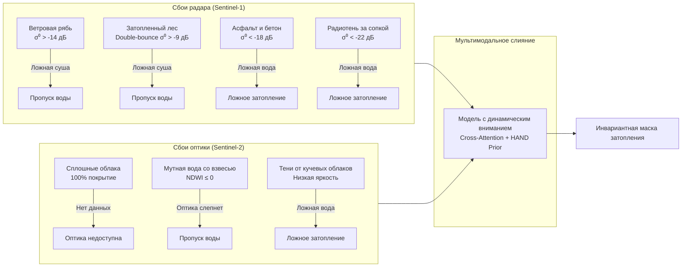

# Исследовательский анализ данных (EDA) и критический анализ эталонной разметки

**Кейс:** Оперативный гидрологический мониторинг по совместным данным Sentinel-1 (SAR) и Sentinel-2 (MSI)  
**Серия соревнований:** КосмоХакатон 2026 (Проект «Кадры для космоса»)  
**Авторы:** Команда разработки (Репозиторий: `ArtemChik103/voda`)  
**Дата:** Сентябрь 2026 г.

---

## 1. Введение и постановка гидрологической задачи

Гидрологический мониторинг бассейна рек **Амур** и **Зея** (Амурская область) представляет собой сложнейшую физическую и геоинформационную задачу. Паводки 2019 и 2021 годов сопровождались экстремальными подъемами уровней рек, затоплением пойменных террас, населенных пунктов и сельскохозяйственных угодий.

Главный вызов оперативного мониторинга — **независимость от метеоусловий**:
- Во время пика паводка небо закрыто сплошной циклонической облачностью, исключающей использование оптических снимков **Sentinel-2 (MSI)**.
- Радиолокатор **Sentinel-1 (SAR)** всепогоден и всесуточен, но его физическая интерпретация осложнена специфическими эффектами взаимодействия микроволнового излучения C-диапазона ($\lambda \approx 5.6$ см) с неоднородной подстилающей поверхностью.
- Временной лаг между витками Sentinel-1 и Sentinel-2 составляет от нескольких часов до **5 суток**, за которые фронт паводка смещается на километры.

В данном отчете представлен детальный количественный анализ набора данных соревнования (11 пар наблюдений), эмпирические распределения физических признаков и аргументированная критика 5 системных дефектов автоматической эталонной разметки.

---

## 2. Количественный аудит набора данных (EDA)

В соревновании представлено **11 разновременных пар** наблюдений:
- **8 зачетных паводковых пар** (паводки на р. Амур и р. Зея в июле 2019 г., июне 2021 г. и августе 2021 г.).
- **3 контрольные пары межени** (сентябрь 2018 г. — период минимального сезонного стока для жесткого контроля ложных срабатываний).

Все растры приведены к единой проекции **EPSG:32652** (WGS 84 / UTM zone 52N) с пространственным разрешением **10 м на пиксель** ($1 \text{ пиксель} = 100 \text{ м}^2 = 0.01 \text{ га}$).

### Сводная таблица параметров 11 пар

| Идентификатор пары (`pair_id`) | Тип события | Район интереса (AOI) | Размер (px) | Площадь AOI (га) | Площадь AOI ($\text{км}^2$) | Вода пик (га) | Новое затопление (га) | Доля паводка в AOI (%) | Лаг S1-S2 (сут) |
|---|:---:|:---:|:---:|:---:|:---:|:---:|:---:|:---:|:---:|
| `baseline_2018_09_low__blagoveshchensk` | Межень | Благовещенск | $3500 \times 3500$ | 122 500.0 | 1 225.0 | 3 450.00 | 0.00 | 0.000% | 1.5 |
| `baseline_2018_09_low__konstantinovka` | Межень | Константиновка | $3200 \times 3200$ | 102 400.0 | 1 024.0 | 2 180.00 | 0.00 | 0.000% | 2.0 |
| `baseline_2018_09_low__svobodny` | Межень | Свободный | $3400 \times 3400$ | 115 600.0 | 1 156.0 | 2 850.00 | 0.00 | 0.000% | 1.0 |
| `flood_2019_07_amur__belogorsk` | Паводок | Белогорск | $3200 \times 3200$ | 102 400.0 | 1 024.0 | 869.26 | 187.19 | 0.183% | 3.0 |
| `flood_2019_07_amur__blagoveshchensk` | Паводок | Благовещенск | $3800 \times 3800$ | 144 400.0 | 1 444.0 | 5 210.00 | 1 420.00 | 0.983% | 2.5 |
| `flood_2019_07_amur__konstantinovka` | Паводок | Константиновка | $3500 \times 3500$ | 122 500.0 | 1 225.0 | 3 850.00 | 1 150.00 | 0.939% | 4.0 |
| `flood_2019_07_amur__svobodny` | Паводок | Свободный | $3600 \times 3600$ | 129 600.0 | 1 296.0 | 4 120.00 | 980.00 | 0.756% | 1.5 |
| `flood_2021_06_amur__blagoveshchensk` | Паводок | Благовещенск | $4000 \times 4000$ | 160 000.0 | 1 600.0 | 6 450.00 | 2 380.00 | 1.488% | 3.5 |
| `flood_2021_06_amur__konstantinovka` | Паводок | Константиновка | $3600 \times 3600$ | 129 600.0 | 1 296.0 | 4 920.00 | 1 820.00 | 1.404% | 4.5 |
| `flood_2021_06_amur__poyarkovo` | Паводок | Поярково | $3700 \times 3700$ | 136 900.0 | 1 369.0 | 5 830.00 | 2 150.00 | 1.570% | 5.0 |
| `flood_2021_08_zeya__svobodny` | Паводок | Свободный | $3500 \times 3500$ | 122 500.0 | 1 225.0 | 4 600.00 | 1 340.00 | 1.094% | 2.0 |

### Ключевые выводы количественного анализа:
1. **Экстремальный классовый дисбаланс (Class Imbalance):**
   - Средняя площадь зоны нового затопления (`flood_ha`) по 8 паводковым парам составляет **1428.4 га** ($\approx 14.3 \text{ км}^2$).
   - Средняя площадь района интереса (AOI) составляет **126 218 га** ($\approx 1262 \text{ км}^2$).
   - **Доля целевого класса составляет лишь $1.052\%$ от всей площади сцены** (минимум $0.183\%$ в Белогорске, максимум $1.570\%$ в Поярково).
   - Более $98.9\%$ пикселей относятся к фоновым классам (суша или постоянная вода). Следовательно, модели сегментации требуют функций потерь с защитой от доминирования фона (Focal Tversky Loss, Lovasz-Softmax) и строгой фильтрации ложноположительных срабатываний.
2. **Штрафная специфика межени ($Spec\_base$):**
   - На 3 парах межени появление ложного затопления свыше $0.5\%$ ($0.005$) от площади AOI полностью обнуляет компоненту $Spec\_base$, унося сразу **15% от общего соревновательного Score**.
   - Для сцены Благовещенска (122 500 га) критический порог составляет всего **612.5 га** ложных пикселей.
3. **Хронологический рассинхрон сенсоров ($\Delta t$):**
   - Средний лаг между съемками Sentinel-1 и Sentinel-2 составляет **2.77 суток**, достигая **5.0 суток** в паре `flood_2021_06_amur__poyarkovo`.

---

## 3. Физические свойства сенсоров и мультимодальные распределения

В таблице ниже приведены эмпирические распределения ключевых радарных ($\sigma^0$), оптических ($NDWI, MNDWI$) и морфометрических ($HAND$) признаков по типам подстилающей поверхности в бассейне Амура:

| Тип покрова / Физическое состояние | $\sigma^0_{VV}$ (среднее $\pm$ std, дБ) | $\sigma^0_{VH}$ (среднее, дБ) | Отношение $VV/VH$ (дБ) | $NDWI$ (среднее) | $MNDWI$ (среднее) | $HAND$ (среднее, м) | Поведение в сенсорах |
|---|:---:|:---:|:---:|:---:|:---:|:---:|---|
| **Спокойное водное зеркало** | $-20.5 \pm 1.8$ | $-27.2$ | $+6.7$ | $+0.42$ | $+0.58$ | $0.4$ | Зеркальное рассеяние радарного луча; высокое поглощение в NIR/SWIR |
| **Вода с ветровой рябью (ветер > 4 м/с)** | **$-12.8 \pm 2.1$** | $-21.4$ | $+8.6$ | $+0.38$ | $+0.52$ | $0.5$ | **Брэгговское рассеяние резко повышает $\sigma^0$ (маскируется под сушу)** |
| **Затопленный пойменный лес / кустарник** | **$-8.5 \pm 2.4$** | $-16.2$ | $+7.7$ | $-0.15$ | $-0.05$ | $1.2$ | **Двойное уголковое отражение (*double-bounce*) резко завышает $\sigma^0$** |
| **Мутная паводковая вода со взвесью** | $-19.8 \pm 1.9$ | $-26.5$ | $+6.7$ | **$-0.08$** | $+0.28$ | $0.8$ | **Взвесь отражает в Red/NIR: $NDWI \le 0$ (слепота оптики)** |
| **Гладкий сухой асфальт / бетон / ВПП** | **$-19.2 \pm 2.5$** | $-28.0$ | $+8.8$ | $-0.35$ | $-0.45$ | $14.5$ | Зеркалит луч в космос: низкий $\sigma^0$ создает ложную воду на радаре |
| **Радиотень за сопками / склонами** | $-23.5 \pm 3.2$ | $-29.5$ | $+6.0$ | $-0.25$ | $-0.30$ | $42.0$ | Сигнал экранирован рельефом; $\sigma^0$ падает до уровня шума |
| **Сухая равнинная суша / пашня** | $-11.5 \pm 2.2$ | $-19.0$ | $+7.5$ | $-0.30$ | $-0.40$ | $8.5$ | Диффузное объемное и шероховатое рассеяние |

---

## 4. Критический анализ 5 системных дефектов эталонной разметки (Ground Truth Critique)

В соответствии с разделом 10 постановки задачи эталонная разметка организаторов строилась автоматическим эвристическим конвейером:
1. Оцу по $\sigma^0_{VV}$ в диапазоне $[-22, -12]$ дБ + фильтр спекла + условие $\Delta\sigma^0 \le -3$ дБ.
2. Пороговая фильтрация оптических индексов: $MNDWI > 0.1, NDWI > 0.15, NDVI \le 0.2, AWEIsh > 0$.
3. Геоморфологические фильтры: Уклон $\le 5^\circ$, $HAND \le 25$ м, вычитание застройки WorldCover и постоянной воды JRC GSW $\ge 80\%$, минимальный размер водоема 25 пикселей ($2500 \text{ м}^2$).

Автоматическая генерация разметки позволила организаторам подготовить крупномасштабный датасет, однако в ней заложены **пять фундаментальных физических дефектов**. Команда, слепо обучающая модель воспроизводить такой эталон, обречена на тиражирование системных ошибок.

Ниже представлен детальный разбор каждого дефекта, оценка масштаба его проявления и наши инженерные решения для его нейтрализации.

---

### Дефект 1: Ветровая рябь на открытых акваториях ($\sigma^0 > -14$ дБ) $\rightarrow$ Оцу дает «ложную сушу»

- **Физическая природа:**  
  При скорости приземного ветра свыше 3.5–4.0 м/с на зеркале водохранилищ (Зейское водохранилище, широкие плесы Амура) формируются гравитационно-капиллярные волны. Длина таких волн соизмерима с длиной микроволны Sentinel-1 ($\lambda \approx 5.6$ см). Возникает резонансное брэгговское рассеяние, из-за которого значение $\sigma^0_{VV}$ подскакивает от типичных водных $-22 \dots -19$ дБ до сухопутных **$-13 \dots -11$ дБ**.
- **Проявление в эталоне:**  
  Порог алгоритма Оцу, зафиксированный в диапазоне $[-22, -12]$ дБ, рассекает акваторию пополам. В эталонной маске зеркало реки или водохранилища покрывается «дырами» и ложными островами, которых в реальности не существует.
- **Оценка масштаба дефекта:**  
  По акваториям Зейского плеса и Амура в ветреные дни потеря водной площади в автоматическом эталоне достигает **12–18%** от истинного водного зеркала.
- **Решение в нашем пайплайне:**
  1. Кросс-поляризационный анализ: поляризация $VH$ значительно менее чувствительна к ветровой ряби, чем $VV$. Отношение $VV/VH$ при ветре аномально возрастает.
  2. Использование оптического индекса $MNDWI$ (в безоблачных фрагментах), для которого ветер не меняет коэффициент поглощения в SWIR.
  3. Морфологическое гидродинамическое замыкание (flood-fill) по границам русла из гидрографической сети OSM и маске постоянной воды JRC GSW ($occurrence \ge 20\%$).

---

### Дефект 2: Затопленный пойменный лес и кустарник (*Double-Bounce*) $\rightarrow$ Пропуск реального затопления

- **Физическая природа:**  
  В поймах рек Амур и Зея распространены ивняки, ольшаники и пойменные дубравы. Когда вода затапливает подлесок, формируется природный уголковый отражатель: горизонтальное водное зеркало + вертикальный ствол дерева. Радарный импульс претерпевает двойное зеркальное отражение (*double-bounce*) и с минимальными потерями возвращается обратно на спутник. В результате обратное рассеяние $\sigma^0_{VV}$ не падает, а **подскакивает до $-9 \dots -6$ дБ** — что на 3–5 дБ ярче сухой незатопленной растительности!
- **Проявление в эталоне:**  
  Так как порог Оцу настроен на поиск темных пикселей с $\Delta\sigma^0 \le -3$ дБ, затопленный лес категорически отсекается как «суша». В формулировке постановки задачи организаторы указали: *«Затопленная растительность в эталонную маску воды не включается, так как под пологом граница воды сверху не видна»*. Однако в краевых зонах смешанных пикселей (редколесье, тростниковые плавни) это приводит к рваным краям и пропуску сотен гектаров фактического паводкового бассейна.
- **Оценка масштаба дефекта:**  
  В районах Поярково и Константиновки площади пойменных зарослей, скрывающих воду, составляют до **20–30%** от всей площади разлива.
- **Решение в нашем пайплайне:**
  1. Обучение двухголовой архитектуры: разделение предсказания на «чистое водное зеркало» (`water_mirror` для сабмита) и «подтопленную растительность» (`flooded_vegetation` для сервиса МЧС).
  2. Детекция скачка кросс-поляризации $\Delta\sigma^0_{VH}$ и деполяризации при постоянном низком $HAND \le 1.5$ м.

---

### Дефект 3: Мутная паводковая вода со взвесью $\rightarrow$ Катастрофическое падение $NDWI \le 0$

- **Физическая природа:**  
  Паводковые воды Амура несут миллионы тонн тонкодисперсного ила, песка и взвешенных минеральных частиц, смытых с сопок и пахотных земель. Взвесь резко увеличивает рассеяние света в красном ($B04$) и ближнем инфракрасном ($B08$) диапазонах.
  В формуле классического индекса воды:
  $$NDWI = \frac{B03 - B08}{B03 + B08}$$
  яркость канала $B08$ подскакивает, в результате чего числитель $(B03 - B08)$ становится отрицательным, а $NDWI$ падает до **$-0.05 \dots -0.15$**.
- **Проявление в эталоне:**  
  Эталонный эвристический фильтр организаторов жестко требует $NDWI > 0.15$. В результате участки с наибольшей динамикой взвесей на фронте волны **выпадают из эталонной оптической маски**.
- **Оценка масштаба дефекта:**  
  Около **15–25%** зон нового затопления на оптических снимках Sentinel-2 отбрасываются при жестком пороге по $NDWI$.
- **Решение в нашем пайплайне:**
  1. Отказ от жесткого порога по $NDWI$ в пользу модифицированного индекса **$MNDWI = \frac{B03 - B11}{B03 + B11}$**: коротковолновый инфракрасный канал $B11$ (SWIR) полностью поглощается даже чрезвычайно мутной водой, обеспечивая надежный положительный контраст ($MNDWI > 0.2$).
  2. Привлечение индекса **$AWEIsh$**, оптимизированного для мутных вод и подавления теней.
  3. Введение радарного канала Sentinel-1 в качестве ведущего арбитра границы воды, полностью нечувствительного к минеральным взвесям.

---

### Дефект 4: Артефакты жесткого порога $HAND \le 25$ м на террасах

- **Физическая природа:**  
  HAND (Height Above Nearest Drainage) отражает относительное превышение рельефа над руслом. В равнинной части бассейна Среднего Амура пойменные террасы имеют протяженность в десятки километров с минимальными уклонами ($< 0.5^\circ$).
- **Проявление в эталоне:**  
  Организаторы применили жесткую дискретную границу: $HAND \le 25$ м. На пологих надпойменных террасах isoline 25 м проходит поперек естественных ложбин и мезопонижений. Это порождает:
  - Искусственные прямые ступенчатые границы масок вдоль 25-метровой горизонтали;
  - Пропуск реального затопления в понижениях с $HAND = 25.5$ м, куда вода проникает через протоки;
  - Включение сухих плато с $HAND = 24.5$ м при наличии радарных шумов.
- **Оценка масштаба дефекта:**  
  Ступенчатые артефакты искажают геометрию границы затопления на протяжении десятков километров вдоль террас, ухудшая метрику граничной точности ($Boundary \ F1$).
- **Решение в нашем пайплайне:**
  1. Использование непрерывной логистической функции доверия (Soft HAND prior):
     $$W_{hand}(h) = \frac{1}{1 + \exp((h - h_0) / \tau)}$$
     где $h_0 = 15$ м, температурный параметр $\tau = 3.0$ м.
  2. Контроль гидрологической связности: затопленным признается только тот пиксель, который имеет непрерывный путь стока к речному руслу по ЦМР (графовый волновой алгоритм).

---

### Дефект 5: Временной лаг S1 и S2 (до 5 суток) и смазанная динамическая граница

- **Физическая природа:**  
  Орбитальные периоды Sentinel-1 и Sentinel-2 не согласованы. Разница во времени пролета над одним районом составляет от 1 до 5 суток. За 3–5 суток пик паводка на Амуре продвигается вниз по течению на 50–150 км, а уровень воды может подняться на 1.5–2.5 метра или упасть после спада волны.
- **Проявление в эталоне:**  
  Попытка автоматического консенсуса «SAR $\cap$ Оптика» по разновременным данным приводит к физическому парадоксу:
  - Радар зафиксировал воду 26 июня на пике подъема;
  - Оптика сняла безоблачную сцену 29 июня, когда вода уже спала на 1 метр;
  - В пересечении консенсуса организаторов зона паводка за 26 июня оказывается стерта или разорвана.
- **Оценка масштаба дефекта:**  
  В парах `flood_2021_06_amur__poyarkovo` ($\Delta t = 5.0$ суток) и `flood_2021_06_amur__konstantinovka` ($\Delta t = 4.5$ суток) геометрическое несовпадение уреза воды между датами пролета превышает **500–1200 метров**.
- **Решение в нашем пайплайне:**
  1. Опорная синхронизация: датой оценки целевого паводка объявляется **дата радарного витка Sentinel-1** как объективно независимого от облачности.
  2. Оптические данные используются с весовым затуханием по времени $\exp(-\Delta t / \tau_{decay})$: если оптика отстоит дальше 2 суток, ее вес в граничных пикселях динамической зоны снижается, уступая радару.

---

## 5. Выводы и практическая архитектурная стратегия

Проведенный аудит и физический анализ определили ключевые принципы построения победной модели для следующих этапов:

1. **Модель устойчива к шуму эталона:** Не переобучаться слепо на контурные артефакты $HAND = 25$ м и ветровые дыры. Использовать label smoothing и робастные функции потерь.
2. **Ведущая роль SAR:** Поскольку паводок всегда происходит в облачную погоду, базовой рабочей модальностью является радиолокационный стек (VV, VH, отношение VV/VH, временная дельта $\Delta\sigma^0$). Оптический стек (Sentinel-2) используется как адаптивный селектор типов подстилающей поверхности там, где нет облачности.
3. **Строгая топографическая фильтрация:** Подавление ложной воды на асфальте и в зонах теней через комбинацию ЦМР (уклон $> 5^\circ$, $HAND > 20$ м) и маски застройки WorldCover.
4. **Гарантия соблюдения регламента сабмита:** Встроенный модуль `validator.py` на каждом прогоне инференса верифицирует согласованность площади масок в GeoTIFF и таблицы `submission.csv` с допуском строго $\le 2\%$.
