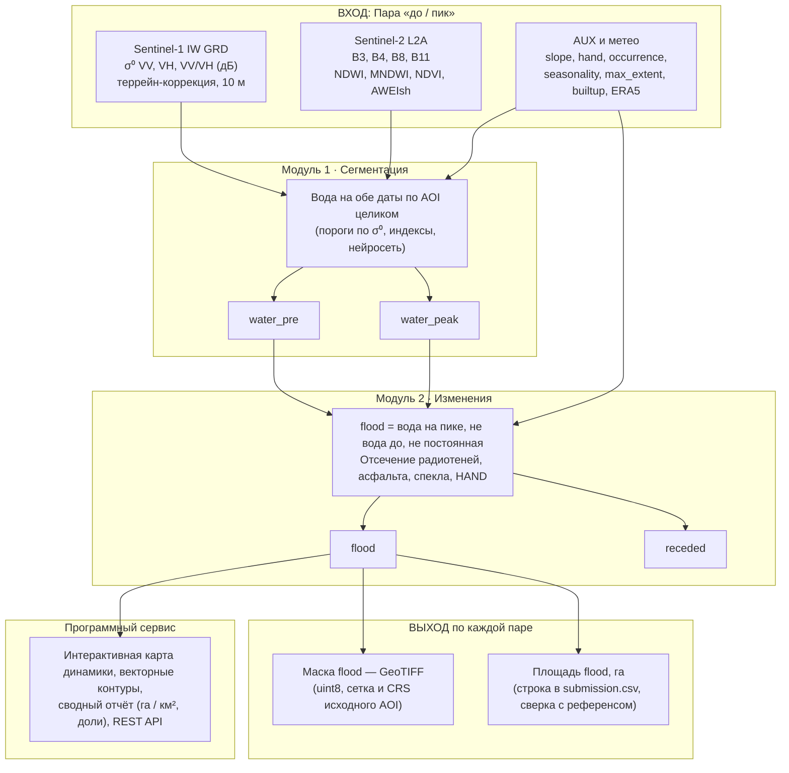

# Постановка кейса: оперативный мониторинг гидрологической динамики по совместным данным Sentinel-1 (SAR) и Sentinel-2 (MSI)

**Серия интеллектуальных соревнований «КосмоХакатон 2026»**  
**Федеральный проект «Кадры для космоса»**  
*Организаторы и партнеры: Минобрнауки России, РОСКОСМОС, РТУ МИРЭА*  
*Официальный портал: космохакатон.рф | Девиз: «6 хакатонов. Один космос.»*

---

## 1. Краткое содержание задачи

Разработать программный комплекс, который по паре разновременных спутниковых наблюдений определяет положение водной поверхности и выделяет зону нового затопления — и продолжает работать при сплошной облачности, когда оптическая съёмка непригодна.

На вход подаются снимки **Sentinel-1 (SAR)** и **Sentinel-2 (MSI)**.  
На выходе формируются три ключевые площади в гектарах (га):
1. **Зона нового затопления** (`flood_ha`);
2. **Водное зеркало на дату «до»** (`water_pre_ha`);
3. **Водное зеркало на дату пика** (`water_peak_ha`).

А также растровые маски затопления формата GeoTIFF и векторные контуры в GeoJSON.

### Усложнения и физические ловушки задачи:
- **Радиолокационные аномалии (SAR):** Часть воды выглядит как суша из-за ветровой ряби (ветер > 3–4 м/с вызывает брэгговское рассеяние, повышая $\sigma^0$) или из-за затопленного леса/кустарника (эффект двойного отражения *double-bounce* резко увеличивает обратное рассеяние). Часть суши выглядит как вода: зеркально гладкие сухие поверхности (асфальт, бетон, взлетно-посадочные полосы, гладкая пашня) и зоны радиотени за сопками и высотными объектами.
- **Оптические ограничения (MSI):** В паводок небо закрыто циклональной сплошной облачностью. Кроме того, мутная паводковая вода из-за высокой концентрации взвешенных частиц (ила, песка) меняет спектральную кривую: отражение в красном и ближнем ИК возрастает, а индекс $NDWI$ падает до околонулевых и отрицательных значений, вызывая систематический пропуск воды.
- **Экстремальный дисбаланс:** Доля нового затопления составляет лишь доли процента от площади района интереса (AOI), поэтому тривиальные подходы дают лавину ложных срабатываний.
- **Несинхронность съёмок:** Временной разрыв между витками Sentinel-1 и Sentinel-2 составляет от нескольких часов до 5 суток. За это время урез паводковой воды смещается на километры.


*Рисунок 1. Схема сквозного решения: от пространственно-временного запроса до масок и площадей.*

---

## 2. Полное описание задачи и проблематика

Мониторинг гидрологических рисков (весенние половодья, летне-осенние дождевые паводки, заторные подъёмы уровня, переработка берегов водохранилищ) требует одновременно **оперативности** и **независимости от погоды**. В реальных условиях эти требования противоречат друг другу:
1. Паводковый фронт проходит в циклональную погоду при сплошной облачности; именно тогда оптика Sentinel-2 непригодна, а безоблачные сцены появляются уже после спада воды.
2. Радиолокационная съёмка Sentinel-1 всепогодна, но её интерпретация физически неоднозначна (шероховатость воды, двойное отражение в растительности, радиотени).
3. Съёмки Sentinel-1 и Sentinel-2 не синхронизированы: разрыв составляет от нескольких часов до нескольких суток, а на пике паводка урез воды смещается за часы.

### Практические последствия для эксплуатирующих организаций:
1. Решения о развёртывании сил МЧС, эвакуации населения и инженерной защите объектов принимаются в течение часов. Международные сервисы работают в режиме отложенной активации по запросу.
2. Переработка берегов, абразия, смещение русел и дельт требуют сопоставления разносезонных наблюдений при разных уровнях воды. Здесь площадной оценки мало — решающее значение имеет позиционная точность самой линии уреза воды (Boundary F1).
3. Неоднородность спутникового архива: для части исторических событий пара «до/после» разнесена во времени на 2 недели и более, и изменения вызваны не только паводком, но и фенологией.

---

## 3. Что разрабатывает команда (Комплект из 5 элементов)

1. **Модуль сегментации водных объектов:** Совместная обработка радиолокационного и оптического каналов. На выходе — бинарные маски водной поверхности по AOI целиком, отдельно на дату «до» и дату «пик».
2. **Модуль пространственно-временного анализа:** Сравнение состояний «до» и «пик». На выходе — маска нового затопления (`flood` = вода на пике, которой не было до события и которая не является постоянным водоемом) и диагностическая маска убыли (`receded`).
3. **Файл с результатами работы (Сабмит):** Файл `submission.csv` с площадями по каждой паре и каталог растровых GeoTIFF-масок затопления `predictions/<pair_id>_flood.tif`.
4. **Интерактивная карта и модуль автоматической отчётности:** Веб-карта динамики затопления (слои «до», «пик», «прирост») поверх картографической подложки, выгрузка контуров в GeoJSON/Shapefile, сводный аналитический отчёт (га, км², доли, раскладка по типам покрова WorldCover), REST API.
5. **Репозиторий, отчёт и презентация:** Исходный код с воспроизводимостью «в один клик» (Docker/скрипт), отчёт по исследованию с абляционными экспериментами и презентация на 8–12 слайдов.

*Примечание:* Метрика автоматической проверки оценивает только площадь маски воды «пик» и зону нового затопления, но сам сервис и сводный отчёт рассчитывают полный гидрологический баланс (включая убыль воды).

---

## 4. Продуктовое видение

Результат кейса — прототип аналитического слоя для регионального контура мониторинга гидрологических рисков (МЧС, Минприроды, бассейновые водные управления).

### Сценарии использования:
1. **Непрерывное обновление:** Пересчет маски затопления по каждому новому радарному витку Sentinel-1 без ожидания безоблачного неба.
2. **Межсезонный мониторинг:** Отслеживание динамики водного зеркала и смещения береговой линии между сезонами и годами.
3. **Программный интерфейс (REST API):** Автоматизированный запрос по Bounding Box / полигону и датам с возвратом GeoJSON, масок и статистики без ручной работы оператора в ГИС.

---

## 5. Теоретический раздел и Глоссарий

| Термин / Сокращение | Определение в рамках кейса |
|---|---|
| **ДЗЗ** | Дистанционное зондирование Земли — получение информации о поверхности планеты по спутниковым данным. |
| **SAR** | Synthetic Aperture Radar — радиолокатор с синтезированной апертурой. Активный сенсор: излучает импульсы и принимает отраженный сигнал, не зависит от облачности и времени суток. |
| **MSI** | Multispectral Instrument — оптико-электронный мультиспектральный сенсор Sentinel-2 (13 каналов). |
| **$\sigma^0$ (сигма-ноль)** | Удельная эффективная площадь рассеяния (УЭПР) — нормированная мощность отраженного радарного сигнала от единицы площади в дБ. |
| **VV / VH** | Поляризации сигнала: VV — вертикальное излучение и прием; VH — вертикальное излучение, горизонтальный прием (кросс-поляризация). |
| **GRD** | Ground Range Detected — уровень обработки Sentinel-1: амплитудные данные в проекции поверхности. |
| **IW** | Interferometric Wide swath — режим Sentinel-1 над сушей: полоса 250 км, разрешение ~10 м. |
| **Спекл-шум** | Зернистый мультипликативный шум интерференции волн от микрорассеивателей внутри пикселя. |
| **Double-bounce** | Двойное отражение: радарный сигнал отражается от воды в вертикальный объект (ствол, стену, тростник) и возвращается усиленным. Дает аномально высокий $\sigma^0$. |
| **Радиотень** | Область, экранированная от радарного луча рельефом или зданием. Имеет предельно низкий $\sigma^0$ (на уровне шума сенсора). |
| **Layover / Foreshortening** | Геометрические искажения радарного снимка на крутых склонах, обращенных к спутнику (наложение и сжатие). |
| **Локальный угол падения** | Угол между лучом радара и локальной нормалью к рельефу. |
| **Восходящая / нисходящая орбита** | Направление витка спутника. Определяет геометрию теней; разноорбитальные пары без радиометрической коррекции несопоставимы. |
| **L1C / L2A** | Sentinel-2: L1C — яркость на верхней границе атмосферы (TOA); L2A — отражение на поверхности земли с атмосферной коррекцией (BOA). |
| **NDWI / MNDWI** | Индексы воды: $NDWI = (B03 - B08) / (B03 + B08)$; $MNDWI = (B03 - B11) / (B03 + B11)$. |
| **AWEI** | Automated Water Extraction Index — мультиспектральный индекс, устойчивый к городским теням. |
| **ЦМР (DEM)** | Цифровая модель рельефа (Copernicus DEM GLO-30). |
| **HAND** | Height Above Nearest Drainage — высота точки над ближайшим руслом по гидрологической линии стока (м). |
| **Водосборный бассейн** | Территория, сток с которой поступает в общий водоток (HydroSHEDS). |
| **Гидрографическая сеть** | Векторная сеть постоянных и временных водотоков (OSM). |
| **Урез воды** | Линия пересечения водной поверхности с сушей (граница маски воды). |
| **Водное зеркало** | Открытая водная поверхность. Затопленный лес водным зеркалом в эталоне не считается. |
| **Половодье / Паводок** | Половодье — ежегодный сезонный подъем воды (весенний). Паводок — резкий подъем от дождей вне зависимости от сезона. |
| **Постоянная / Сезонная вода** | Постоянная — вода круглый год во все годы (JRC GSW occurrence $\ge 80\%$). Сезонная — часть года. |
| **IoU / F1 / BF1** | Метрики качества масок: Intersection over Union, F1-score, Boundary F1. |
| **GeoTIFF / GeoJSON** | Стандартные форматы растровых и векторных геоданных. |

---

## 6. Физические принципы: как сенсоры видят воду

### Радиолокатор (Sentinel-1 SAR):
Спокойная вода действует как зеркало: сигнал уходит вперед и не возвращается на спутник ($\sigma^0$ низкий, от $-24$ до $-18$ дБ). Суша шероховата, дает диффузное рассеяние ($\sigma^0$ от $-12$ до $-6$ дБ). Гистограмма бимодальна, что позволяет применить порог Оцу.

#### Шесть типовых сбоев радарного признака воды:
1. **Спокойная вода:** Зеркальное отражение $\rightarrow$ $\sigma^0$ низкий $\rightarrow$ Темная на снимке (базовый признак).
2. **Шероховатая суша:** Диффузное рассеяние $\rightarrow$ $\sigma^0$ высокий $\rightarrow$ Светлая (контраст с водой).
3. **Ветровая рябь (ветер > 3–4 м/с):** Капиллярные волны $\rightarrow$ $\sigma^0$ подскакивает $\rightarrow$ **Пропуск воды (вода выглядит как суша).**
4. **Затопленный лес и тростник:** Двойное уголковое отражение (вода + ствол) $\rightarrow$ $\sigma^0$ выше, чем у сухой суши $\rightarrow$ **Пропуск воды.**
5. **Гладкая сухая суша (асфальт, ВПП, бетон, гладкая пашня):** Зеркалит луч в космос $\rightarrow$ $\sigma^0$ низкий $\rightarrow$ **Ложная вода.**
6. **Радиотень рельефа и застройки:** Сигнал затенен сопкой $\rightarrow$ $\sigma^0 \approx$ шум $\rightarrow$ **Ложная вода.**
*(Спекл-шум накладывается во всех случаях, размывая границы и порождая точечные ложные объекты).*

---

### Оптический сенсор (Sentinel-2 MSI):
Вода поглощает в NIR ($B08$) и SWIR ($B11, B12$), слабо отражая в зеленом ($B03$).
- $NDWI = (B03 - B08) / (B03 + B08)$
- $MNDWI = (B03 - B11) / (B03 + B11)$

**Ключевой сбой оптики при паводке:**  
Мутная паводковая вода насыщена взвесями (ил, песок). Взвесь резко увеличивает отражение в красном ($B04$) и NIR ($B08$), из-за чего $NDWI$ катастрофически падает до 0 и отрицательных значений $\rightarrow$ **систематический пропуск паводковой воды оптикой.**

---

### Независимость ошибок SAR и Оптики:

| Проблемная ситуация | Оптика S2 | Радар S1 | Синергия в комплексе |
|---|:---:|:---:|---|
| Сплошная паводковая облачность | ❌ Не видит | ✔️ Видит сквозь облака | Полная замена оптического канала радаром |
| Мутная вода с наносами | ❌ NDWI падает ≤ 0 | ✔️ Зеркалит сигнал | Радар четко детектирует границу |
| Тень от кучевых облаков | ❌ Ложная вода | ✔️ Тени облаков отсутствуют | Радар отвергает оптические тени |
| Ветровая рябь на водохранилище | ✔️ Вода темная в NIR | ❌ $\sigma^0$ возрастает | Оптика устраняет ложную сушу радара |
| Асфальт, бетон, ВПП | ✔️ MNDWI < 0 | ❌ Зеркалит как вода | Оптика + маска OSM/Built-up отсекают асфальт |
| Радиотень за сопкой | ✔️ Освещена солнцем | ❌ Провал $\sigma^0$ в шум | DEM/Оптика отсекают радиотень |
| Затопленный лес и тростник | ❌ Кроны зеленые | ❌ Double-bounce дает яркость | Поляризация VH/VV, временная дельта $\Delta\sigma^0$, HAND |

---

## 7. Гидрологический контекст и применение HAND

Вспомогательные слои устраняют физически невозможные ложные срабатывания:
1. **HAND (Height Above Nearest Drainage):** Высота над руслом по линии стока:
   - $HAND \le 2$ м: пойма, зона реального затопления.
   - $HAND \approx 2 \dots 8$ м: надпойменная терраса, редкие паводки.
   - $HAND > 15 \dots 20$ м: склон долины, затопление невозможно.
2. **Где HAND не работает:** Дельты, морские побережья, прорывы плотин/дамб, ливневые подтопления понижений рельефа вне речной сети. Поэтому HAND используется как **признак-подсказка**, а не слепой жесткий порог.
3. **Уклон (Slope):** На склонах круче 5–10° сплошного затопления быть не может.
4. **Гидрографическая сеть и связность:** Паводок распространяется связным фронтом от русла; изолированные пятна на водоразделе — артефакты.
5. **Маска постоянной воды (JRC GSW):** Исключает фоновые озера и русла из зоны нового паводка.
6. **Водосборные бассейны (HydroSHEDS):** Единица гидрологической агрегации в сводном отчете.

---

## 8. Определение классов в эталоне

- `water_pre`: открытая вода на дату «до».
- `water_peak`: открытая вода на дату «пик» (оценивается).
- `permanent`: постоянная вода по JRC GSW (occurrence $\ge 80\%$). Исключается из затопления.
- `flood`: **целевой класс**: вода есть на пике, её не было на дату «до», и она не постоянная.
- `receded`: ушедшая вода между датами (диагностический канал, для отчета).
- *Затопленная растительность:* в эталонную маску воды **не включается**, так как под пологом граница воды сверху не видна и не воспроизводима. В сервисе учитывается отдельным слоем.

---

## 9. Данные соревнования

- **Проекция:** EPSG:32652 (WGS 84 / UTM zone 52N), разрешение 10 м, сетка попиксельно совмещена.
- **Размер растров:** от $3000 \times 3000$ до $4500 \times 4500$ пикселей (площадь 900–1650 км²).
- **Матрица пар (11 пар):**
  - *8 зачётных паводковых пар:*
    - `flood_2019_07_amur__belogorsk`
    - `flood_2019_07_amur__blagoveshchensk`
    - `flood_2019_07_amur__konstantinovka`
    - `flood_2019_07_amur__svobodny`
    - `flood_2021_06_amur__blagoveshchensk`
    - `flood_2021_06_amur__konstantinovka`
    - `flood_2021_06_amur__poyarkovo`
    - `flood_2021_08_zeya__svobodny`
  - *3 контрольные пары межени:*
    - `baseline_2018_09_low__blagoveshchensk`
    - `baseline_2018_09_low__konstantinovka`
    - `baseline_2018_09_low__svobodny`

### Структура набора:
- `vectors/`: Границы Амурской области, AOI, реки OSM, бассейны HydroSHEDS.
- `tables/`: Реестры сцен, дат, метаданные.
- `rasters/<событие>/<AOI>/`:
  - `S1_pre.tif`, `S1_peak.tif` ($\sigma^0$ VV, VH, VV/VH в дБ, RTC, 10 м).
  - `SENTINEL2_pre.tif`, `SENTINEL2_peak.tif` (B3, B4, B8, B11, NDWI, MNDWI, NDVI, AWEIsh).
  - `AUX_terrain_gsw.tif` (каналы: slope, hand, occurrence, seasonality, max_extent, builtup).
  - Посуточный ряд ERA5.
- `reference_masks/`: 5-канальные эталоны.
- `sample_submission.csv`: шаблон сабмита.

---

## 10. Алгоритм построения эталонной разметки

Эталон построен организаторами автоматически:
1. **SAR:** Порог по VV методом Оцу в диапазоне $[-22, -12]$ дБ, фильтр спекла, требование падения обратного рассеяния $\Delta\sigma^0 \le -3$ дБ на пике.
2. **Оптика:** MNDWI > 0.1, NDWI > 0.15, NDVI $\le 0.2$, AWEIsh > 0 (где есть оптика).
3. **Фильтры:** Уклон $\le 5^\circ$, HAND $\le 25$ м, исключение застройки WorldCover, постоянная вода GSW $\ge 80\%$, минимальный размер водоема — 25 пикселей ($2500 \text{ м}^2$).
4. **Консенсус:** Приоритет согласия SAR и Оптики, затем GSW, верификация по картам Copernicus EMS.

---

## 11. Формат сабмита и требования к маскам

### 1. Файл `submission.csv`:
UTF-8, разделитель запятая, 4 колонки, 11 строк пар:
```csv
pair_id,flood_ha,water_pre_ha,water_peak_ha
flood_2019_07_amur__belogorsk,187.19,694.27,869.26
...
```
- Числа неотрицательны, с точностью до сотых, разделитель — точка.
- $flood\_ha \le water\_peak\_ha \le \text{площадь района}$. Без пропусков и NaN.

### 2. Растровые маски:
В каталоге `predictions/<pair_id>_flood.tif`:
- Формат GeoTIFF, uint8, значения только 0 и 1.
- Полное совпадение сетки, размера, аффинной матрицы и CRS с опорной выгрузкой.
- **Жёсткий допуск:** Расхождение площади по маске и в CSV не должно превышать 2%! Расхождение > 2% считается несогласованностью.

---

## 12. Метрика оценки

$$\text{Score} = 0.45 \cdot Q_{\text{flood}} + 0.25 \cdot Q_{\text{water\_peak}} + 0.15 \cdot Q_{\text{water\_pre}} + 0.15 \cdot \text{Spec\_base}$$

Сходимость площади по каждой паре:
$$q = \max\left(0;\, 1 - \frac{|X_{\text{посылки}} - X_{\text{эталона}}|}{\max(X_{\text{эталона}};\, \text{порог})}\right)$$
- Порог для затопления: **50 га**
- Порог для водного зеркала: **200 га**
- $Q$ — среднее $q$ по 8 паводковым парам.

Контроль ложных срабатываний на 3 парах межени:
$$\text{доля} = \frac{\max(0;\, \text{flood}_{\text{посылки}} - \text{flood}_{\text{эталона}})}{\text{площадь района}}$$
$$\text{Spec\_base} = \text{среднее по 3 парам от } \left(1 - \min\left(1;\, \frac{\text{доля}}{0.005}\right)\right)$$
*(Ложное затопление свыше 0.5% площади района полностью обнуляет компоненту Spec_base).*

Баллы раздела «Метрика» (до 7 баллов за Score + 3 балла за валидность):
$$\text{Балл} = 7 \cdot \frac{\text{Score}_i - \text{Score}_{\text{worst}}}{\text{Score}_{\text{best}} - \text{Score}_{\text{worst}}}$$

---

## 13. Технические требования и воспроизводимость

1. Инференс «под ключ» через `Dockerfile` / `docker-compose.yml` или единую команду запуска.
2. Инференс работает **строго автономно без доступа в сеть**.
3. Фиксация всех seed. Повторный прогон дает разницу Score $\le 0.005$.
4. Оконная (тайловая) обработка растров, предотвращающая нехватку видеопамяти.
5. Пиковое потребление памяти и время инференса должны быть зафиксированы в `README.md`.

---

## 14. Ограничения соревнования и основания для дисквалификации

- **Подмена расчета эталоном:** Списывание эталонных масок вместо честного расчета $\rightarrow$ **Дисквалификация**.
- **Невоспроизводимость:** Невозможность воспроизвести результат по инструкции $\rightarrow$ **Обнуление разделов «Метрика» и «Воспроизводимость»**.
- **Ручное вмешательство:** Ручная правка полигонов человеком $\rightarrow$ **Дисквалификация**.
- **Невалидный сабмит:** Нарушение формата, расхождение > 2% $\rightarrow$ **0 баллов за раздел «Метрика»**.
- **ПО:** Исключительно свободное и открытое ПО.
- **Внешние данные:** Разрешены публичные предобученные модели до старта хакатона и открытые датасеты ДЗЗ для обучения. Запрещено использовать продукты оперативного картирования по тестовым парам.

---

## 15. Требования к отчету и презентации

### Рекомендуемая структура отчета (8 разделов):
1. Описание задачи и протокола оценки.
2. Исследовательский анализ данных (EDA): распределение площадей, дисбаланс, рассинхрон съемок, статистика $\sigma^0$ и индексов.
3. Анализ существующих подходов и их ограничений.
4. Архитектура решения и пайплайн: схема слияния SAR и MSI, обработка пропусков оптики, валидация.
5. Эксперименты, абляции и сравнения: вклад каждого компонента, честные неудачные гипотезы.
6. Предметные и инженерные решения: спекл, углы падения, затопленный лес, асфальт, тени, HAND, связность, постобработка.
7. Финальная конфигурация: обоснование выбора.
8. Выводы, остающиеся ошибки и план развития.

### Презентация:
Объем 8–12 слайдов: постановка, архитектура, мультимодальное слияние, таблица метрик и абляций, демонстрация интерактивного сервиса/карты, слабые места и выводы.
